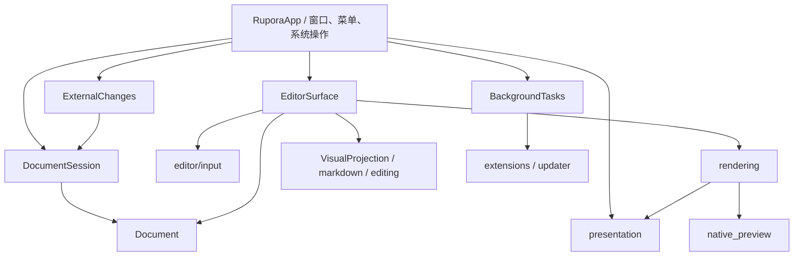

# RUPORA 2 原生模块架构

## 模块所有权与依赖方向

`RuporaApp` 是窗口与系统操作的组合入口。当前正文光标、IME 会话、块选择、
分栏滚动、SVG/块高缓存和后台线程接收器由下列模块独占管理。
App 只另持有尚待交付的原生输入、目标文档 ID 和用于恢复交付上下文的光标书签副本；
该调度边界见 [ADR-0001](adr/0001-ordered-native-input.md)。

| 模块 | 管理的状态与行为 | 对外协作方式 |
| --- | --- | --- |
| `document::Document` | 文本、路径、历史、dirty、派生状态与单调版本 | `edit` 原子提交；只读快照与版本校验；实际磁盘操作 |
| `session::DocumentSession` | 文档集合、活动文档 ID、未命名编号；加入、切换、关闭、恢复文件去重 | 按 `Document::id()` 修改会话；`edit_if_current` 统一处理关闭和过期目标 |
| `editor::EditorSurface` | 光标与焦点请求、IME、跨块选择、文档视图书签、滚动；输入、格式及撤销事务 | `show(ui, &mut Document, EditorOptions) -> EditorOutput`；选择、绑定、失效和历史操作 |
| `rendering::RenderCache` | 文档渲染准备、原生块布局、galley 命中、无障碍、资源与块高缓存 | 准备的块统一提供高度估计、呈现和测量记录；拥有依赖失效规则 |
| `external_changes::ExternalChanges` | 扫描节流、按文档身份记录冲突与错误；重载、合并、重新关联 | 接收 Session 与时间，返回文档变更结果；不接触对话框或编辑器 |
| `background::BackgroundTasks` | 扩展配置、更新与扩展线程生命周期、非阻塞收取结果 | 启动任务、查询运行状态、`poll()` 返回带原文档身份和快照的结果 |
| `presentation` | 颜色、字体、图标、页面和代码块外观 | 无应用状态的绘制函数与值类型 |



编辑器内部的 `source.rs`、`hybrid.rs`、`preview.rs` 和 `input.rs` 是私有实现。
它们不能取得整个 App、文档数组、工作区、恢复目录或文件对话框；当前文档通过唯一的
`&mut Document` 传入。资源根目录由壳层解析后传入，渲染过程不能切换文档或打开外部程序。

输入和历史事务在编辑器内部完成。一次回车引起结构变化后，后续输入重新读取块索引；
同帧文字输入先提交，再执行延迟撤销，最后绘制分栏预览。源码编辑区的右键格式和历史
操作遵守相同顺序。`EditorOutput` 只携带提示、点击的链接、粘贴图片或打开表格窗口请求，
这些系统/附属窗口操作由 App 执行。

源码和分栏的 IME 预编辑保存在 EditorSurface 的临时缓冲中，不改变 Document 的正文、
版本或历史。确认候选后一次写回并形成独立撤销事务，选择候选的停顿不受普通打字的
合并时限影响。取消、视图切换或失焦丢弃临时缓冲；输入后端过滤输入法已消费的按键，
普通输入或指针操作中断组合时，先恢复正文选区再交给 TextEdit 执行，并通知系统结束
组合。空闲源码帧仍使用首次修改才捕获正文的适配器。

Document 分别管理块索引（含引用定义）和全文统计的过期状态。输入、撤销和重做同时使
两者失效；`blocks()`、`references()` 和 `render_view()` 只立即更新结构，不再提前执行
全文分析。字数、行数和大纲沿用 App 的 120 毫秒空闲刷新；需要最新统计的调用者使用
`refresh_derived_state()`。`derived_state_is_stale()` 在统计未刷新时仍为真，确保壳层继续
安排重绘。显式旧接口 `update_after_edit()` 和磁盘重载仍同步准备完整派生状态。

Hybrid 与 Preview（包括分栏中的预览）通过 `DocumentRenderView` 同时借用正文、块范围
和引用定义，保证范围属于当前正文，避免每帧复制整篇文本和块数组。借用期间不能编辑文档；
渲染只收集待写回的修改，借用结束后通过 `Document::edit` 提交。只有实际编辑时才创建
事务工作副本；点击激活所需的字符位置在写回前从本帧正文解析。

切换文档先记录旧文档视图，再由 Session 切换稳定 ID，最后绑定新文档并恢复、钳位选区。
关闭非活动标签不会重置当前输入状态。重载保留文档 ID，同时显式失效旧书签、输入状态和
块高度。块 ID 可以在内容改变后保持不变，因此缓存复用还需要校验渲染依赖：自身源码、
生成的目录、引用定义与本地图片版本。估计和测量必须使用同一个准备结果。

扩展与表格的延迟写回都进入 Session 的条件编辑入口：先定位文档，再由 Document 比较
快照版本，最后通过编辑事务一起提交正文、历史、dirty 和派生失效。后台模块只持有只读快照，
不能直接修改文档。正文编辑、撤销、重做、重载、合并、重新关联及改变路径或编码的另存为都会推进版本；
正文恢复原样仍不能接受旧结果。失败操作、无变化的事务和保留编码的原路径保存不推进版本。
表格应用失败保留草稿，可复制其 Markdown。成功写回统一通知 EditorSurface 清理旧组合输入和跨块选择。

ExternalChanges 以稳定文档身份去重扫描错误，健康标签不会清除其他标签的错误。
自动重载和用户选择的解决操作由相同模块协调；App 只负责确认、提示及相应视图的失效。
启动失败或线程断开会释放后台任务槽，后续启动可以恢复。

模块边界的回归分别位于 `session.rs`、`background.rs`、`rendering.rs`、
`editor/session_tests.rs`、`editor/input_tests.rs` 和 `paragraph_layout_tests.rs`。
`app_tests.rs`、`product_input_tests.rs`、`product_document_tests.rs` 保留跨模块和菜单集成回归。

当前兼容限制：`Document.content/path` 等旧公开字段，以及 Session 的可变文档借用仍然保留。
直接修改正文必须调用 `record_edit` 或 `update_after_edit`；新功能应使用事务入口。
这轮没有宣称类型系统已经封闭所有旧调用方式。输入适配器整体迁移时再收紧这些接口，
同时保留空闲帧不克隆全文的性能约束。

## 重写边界

RUPORA 1.x 的窗口由 Tauri 创建，但编辑、Markdown 解析和渲染均由 Vue/Vditor 在系统
WebView 中完成。Rust 只负责文件读写和少量系统调用，因此它是“Rust 后端的 Web 编辑器”，
不是 Rust 编辑器内核。

RUPORA 2 的默认构建入口改为原生 Rust：

```text
OS window + native input
          │
          ▼
     eframe / egui
          │
          ├── Document：内容、编码、换行、dirty、指纹和文件生命周期
          ├── editing：字符安全的选择区、查找替换与 Markdown 命令
          ├── pulldown-cmark：GFM、源码范围、块、大纲和 HTML
          ├── VisualProjection：RUPORA 可逆布局、样式、命中与编辑写回
          ├── native_preview / RaTeX / mermaid-svg：原生资源块组件
          ├── printpdf：原生 PDF 导出
          ├── RecoveryStore：带校验的崩溃快照和会话
          ├── InstanceCoordinator：单实例文件转交
          ├── diagnostics / updater：诊断日志与后台更新检查
          ├── extensions：默认关闭的进程外 JSON 服务、数据权限和资源上限
          └── Workspace：受限递归目录树
```

运行 `cargo build` 或 `cargo run` 不会调用 Node.js、Vite、Vue、Vditor、Tauri 或 WebView。
2.x 仓库已移除 1.x WebView 实现及其 Node/Tauri 构建链；跨平台图标独立保存在
`assets/icons/`。

## 文档不变量

- `Document.content` 始终使用 Rust UTF-8 `String` 和内部 `\n`。
- `Document::id()` 标识已打开的文档实例；重载和保存不会改变 ID，关闭后新建文档得到新的 ID。
- 载入时记录原始编码、BOM 和换行风格；普通保存时恢复这些表示。“另存为 UTF-8…”显式转换编码并保留换行风格，写入成功后才更新文档编码。
- dirty 状态由当前内容和最后一次成功保存的内容比较，不使用“一旦编辑永远为真”的标志。
- 已保存文件带有长度、修改时间和内容哈希指纹；覆盖外部修改前必须显式确认。
- 写入先落到同目录临时文件并同步，再原子替换目标。
- 另存为失败不会改变文档原路径和已保存基线。
- 所有 UI 修改入口记录为文档级事务；撤销历史只保存 Unicode 边界安全的最小文本补丁。
- 连续输入在短时间窗口内合并，格式化、替换和任务列表操作保持独立撤销步骤。

## 单画布所见即所得编辑

`markdown::blocks` 使用 `pulldown-cmark` 的源码偏移范围生成顶层 `MarkdownBlock`。默认模式在同一
个扁平编辑器工作区内让活动块进入原生 `TextEdit`，失焦块仍使用同一个
`wysiwyg::VisualProjection` 和同一套 RUPORA `LayoutJob`/galley。项目不再包含
`egui_commonmark`，也不存在“简单块精确、复杂块按矩形比例猜测”的双渲染路径。

`VisualProjection` 将 Markdown 投影为视觉文本，记录每个视觉字符到 UTF-8 源码边界的单调映射，
并携带标题、强调、列表、任务、引用、链接、表格、代码和脚注样式。鼠标点击通过实际 galley
逐字形命中；编辑差异通过同一映射写回原 Markdown。行内代码、普通链接和图片只在光标进入时显露
需要编辑的标记/目标；自动链接直接编辑可见 URL，内容不再构成合法自动链接时移除隐藏的尖括号。
折叠和快捷引用链接直接编辑可见标签；首次修改时将原引用 ID 写为显式引用，避免标签变化使链接
退化成字面括号。仅由末尾引用定义产生的空行不进入视觉文本，以免编辑该空行时把定义合并到
正文；普通源文末尾换行仍可编辑。
回车续行由 Markdown 结构规则补全列表序号、任务框或引用前缀。

代码块使用 RUPORA 词法着色与复制控件；独立图片、块公式和 Mermaid 由 `native_preview` 生成
原生资源组件。资源块和失焦代码块具有离散的源码首尾边界，跨块拖选只能整体包含它们，不会
生成无法保存的半资源状态。任务框点击直接形成独立撤销事务；Ctrl/Cmd+点击链接使用命中后的
源码目标，并继续执行工作区路径边界检查。点击编辑区空白或按 Escape 会恢复排版态。编辑事务
立即更新正文、dirty 状态和紧凑补丁；大纲与统计在 120 ms 输入空闲窗口后刷新，
块索引及引用定义在编辑器或渲染器下一次读取时同步刷新。

查找、格式命令和大纲使用 Unicode 字符索引；块范围来自 UTF-8 字节索引。应用边界层负责二者
转换，避免中文或 emoji 破坏切片边界。视觉边界映射由 `VisualProjection` 单独作为编辑与排版
的权威来源；删除了旧的矩形归一化 `source_map` 兼容层。

块索引通过未变化内容锚点和相邻变化块匹配维持稳定 `BlockId`。在块前方插入内容或修改块
自身后，活动块和 egui 控件 ID 不再依赖易变化的字节起点。标题、正文和代码块在编辑时使用
对应的字号与字体。点击已排版块直接查询实际 galley 字形位置；普通文本支持精确跨块选择，
代码和媒体资源遵守全选或不选的原子规则。

## 恢复与持久化

- eframe 存储保存主题、面板、视图模式、最近文件、会话文件、活动文件和工作区。
- `RecoveryStore` 每五秒把 dirty 文档写到独立原子 JSON 快照。
- 正常退出清理恢复快照；异常退出后优先恢复快照，避免被普通会话文件覆盖。
- 应用空闲时仍每 500 ms 获得计时唤醒，并每两秒检查一次文件元数据。
- 干净文档检测到外部变化后自动重载；脏文档保留编辑内容并显示重新加载/另存为操作条。

## 扩展边界

扩展配置不进入 eframe 会话状态，而是位于应用数据目录的独立 `extensions.json`，默认
`enabled: false`。服务必须使用绝对可执行路径，RUPORA 不调用 shell，并在清空环境后通过
stdin/stdout 发送一次 JSON 请求。正文、路径和全文替换分别受权限控制；输入、输出和执行时间
都有硬上限。扩展结果只在原文没有并发变化时作为一个可撤销事务写回。

这是进程与协议隔离，不是 OS 沙箱；外部程序仍拥有当前用户权限。完整边界和协议见
[扩展文档](EXTENSIONS.md)。

## 发布

- `build.rs` 在 Windows 可执行文件中嵌入 ICO 和产品元数据。
- `cargo-packager` 从 Cargo 元数据读取名称、标识符、图标、许可证和文件关联。
- 三平台 CI 执行格式、单元/属性测试、Clippy 和 release 构建；定时任务编译 fuzz 目标。
- `cargo-deny` 的 RustSec advisory 检查阻断漏洞，并同时拦截未知来源和未允许许可证。
- `v2.*` 标签在 Windows、Linux、macOS 的 x86_64/ARM64 原生 runner 上构建安装包，并附加
  SHA-256、CycloneDX SBOM 和 GitHub OIDC 构建来源证明。
- 更新检查只信任 target 匹配的 Ed25519 签名清单；清单把版本、架构、产物 URL、长度和
  SHA-256 绑定在同一个签名载荷中，任何缺失或篡改都会安全失败。
- macOS 证书和 Windows Authenticode 证书只从仓库密钥注入，不进入源码或构建日志。
